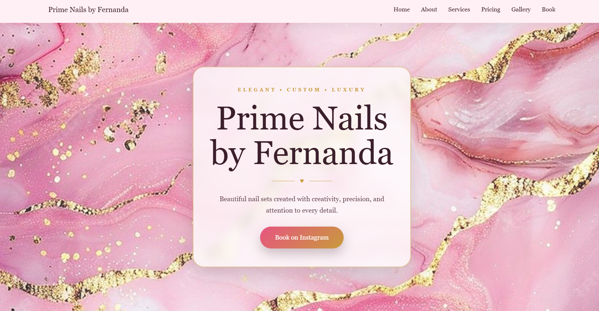
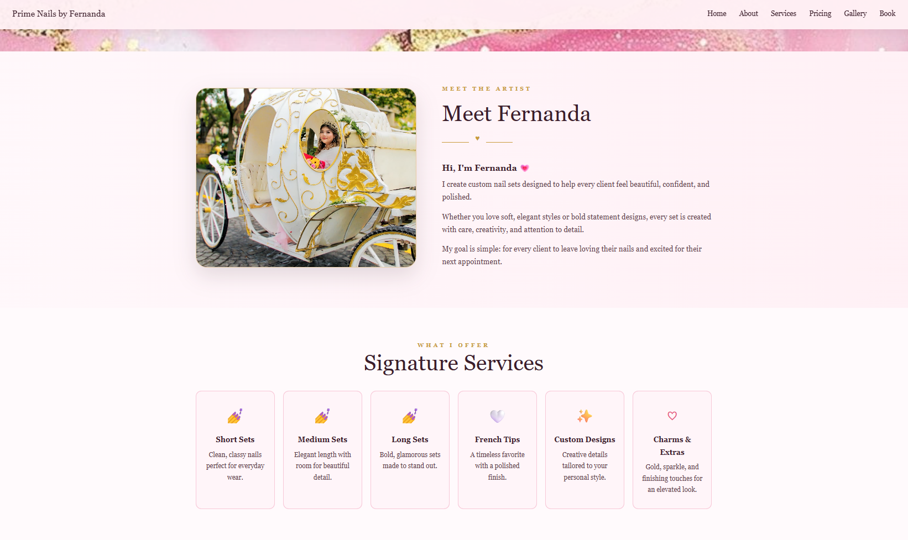
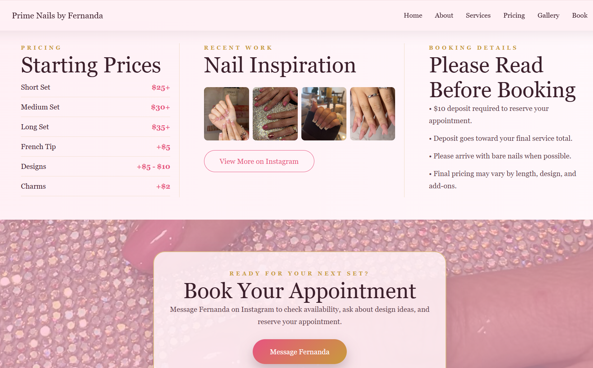

  

<h1 align="center">💅 Prime Nails by Fernanda 💅</h1>

Luxury Nail Artist Website Designed to Showcase Services, Pricing, Portfolio Work, and Booking Information

 

## 🌐 Live Demo

🔗 https://angelacoreas1989-boop.github.io/prime-nails-by-fernanda/

---

# ✦ Project Overview

Prime Nails by Fernanda is a luxury beauty website created for an independent nail artist.

The website provides a professional online presence where clients can explore services, review pricing, browse recent nail designs, learn about the artist, and access booking information through Instagram.

Designed with a feminine pink-and-gold aesthetic, the site delivers a polished user experience while helping the business establish a stronger online presence beyond social media.

---

# ✦ Business Problem

Many independent beauty professionals rely exclusively on social media to showcase their work and communicate with clients.

While social media is valuable, it can make it difficult for potential clients to quickly find:

- Service information
- Pricing
- Portfolio examples
- Booking details
- Business information

Without a dedicated website, important information often becomes scattered across posts, stories, and direct messages.

---

# ✦ Solution

This project provides a centralized online presence that allows clients to:

- Learn about the nail artist
- View available services
- Review pricing information
- Browse portfolio work
- Access booking details
- Connect directly through Instagram

The website supports the artist’s current booking workflow while creating a professional and memorable brand experience.

---

# ✦ Features

✅ Luxury pink and gold branding

✅ Responsive design for desktop and mobile devices

✅ About the Artist section

✅ Service offerings

✅ Pricing information

✅ Nail inspiration gallery

✅ Booking information

✅ Instagram integration

✅ Professional business presentation

---

# ✦ Tech Stack

  

HTML • CSS • JavaScript • Git • GitHub • VS Code

---

## ✦ Website Preview

### Homepage

The homepage introduces visitors to Prime Nails by Fernanda with elegant branding, featured services, and clear navigation designed to make booking simple and accessible.

### About & Services

Customers can learn about Fernanda, view service details, and understand what nail services are offered.

### Booking Section

The booking section provides customers with:

- Pricing information
- Recent nail inspiration designs
- Appointment requirements
- Deposit policy details
- Direct Instagram booking access

This section helps clients understand the booking process while providing examples of previous work and service pricing.
